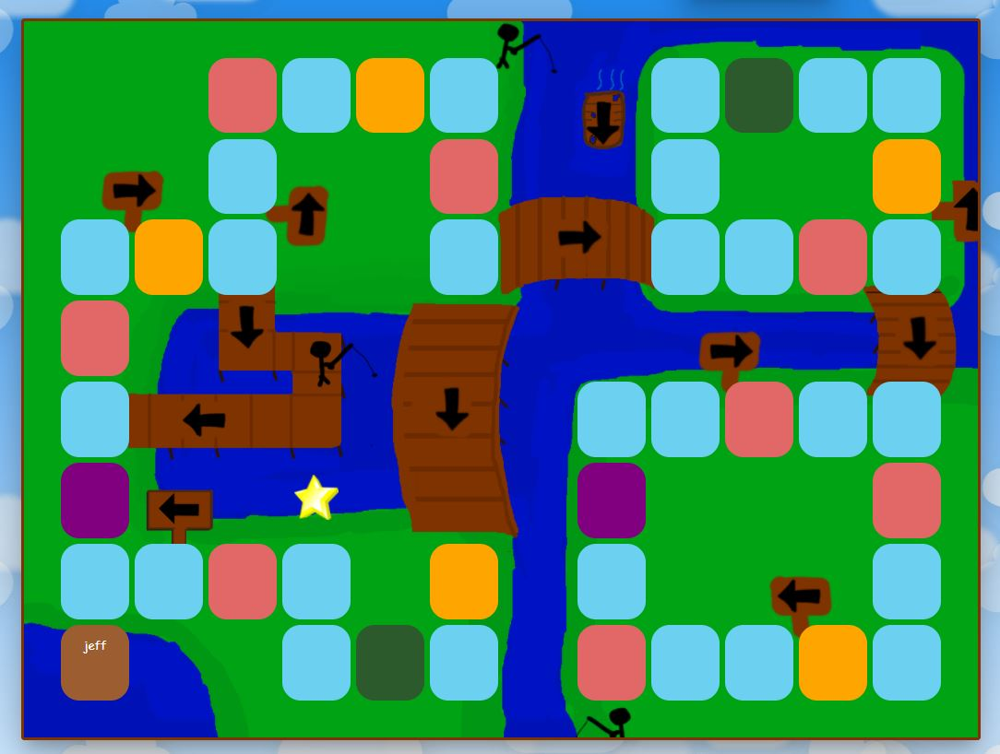

<p align="center">
  <a href="" rel="noopener">
 </a>
</p>

<h1 align="center">Browser Party</h3>

<div align="center">

[]()
[](https://github.com/jefliu123/browser-party/issues)
[](https://github.com/jefliu123/browser-party/pulls)
[](/LICENSE)

</div>

---

<p align="center"> Browser Party is a free, online, multiplayer board game where players race around the board to collect stars and play fun browser minigames.
    <br> 
</p>

<h2 align="center">

[browserparty.web.app](https://browserparty.web.app/)

</h2>

## 📝 Table of Contents

- [About](#about)
- [How to Run](#how_to_run)
- [Deployment](#deployment)
- [Built Using](#built_using)
- [Authors](#authors)

## 🧐 About <a name = "about"></a>

Browser Party is a multiplayer online game I created using React.js and Firebase. The game is based on Mario Party where players roll a dice each turn and move on the game board while collecting coins and stars along the way. When a player passes a star they can buy it if they have enough coins. At the end of each round of turns, there is a minigame where players play a randomly chosen browser game for coins. The player with the most stars at the end of the game wins.

## 🏁 How to Run <a name = "how_to_run"></a>

First install all dependencies with

```
npm install
```

then start the server with

```
npm start
```

## 🚀 Deployment <a name = "deployment"></a>

Current deployment uses Firebase Hosting

First build the project with

```
npm run build
```

then deploy with

```
firebase deploy --only hosting
```

## ⛏️ Built Using <a name = "built_using"></a>

- [ReactJS](https://reactjs.org/) - Web Framework
- [Firebase](https://firebase.google.com/) - Backend & Hosting Service

## ✍️ Authors <a name = "authors"></a>

- [@jefliu123](https://github.com/jefliu123) - Idea & Initial work

See also the list of [contributors](https://github.com/jefliu123/browser-party/contributors) who participated in this project.
